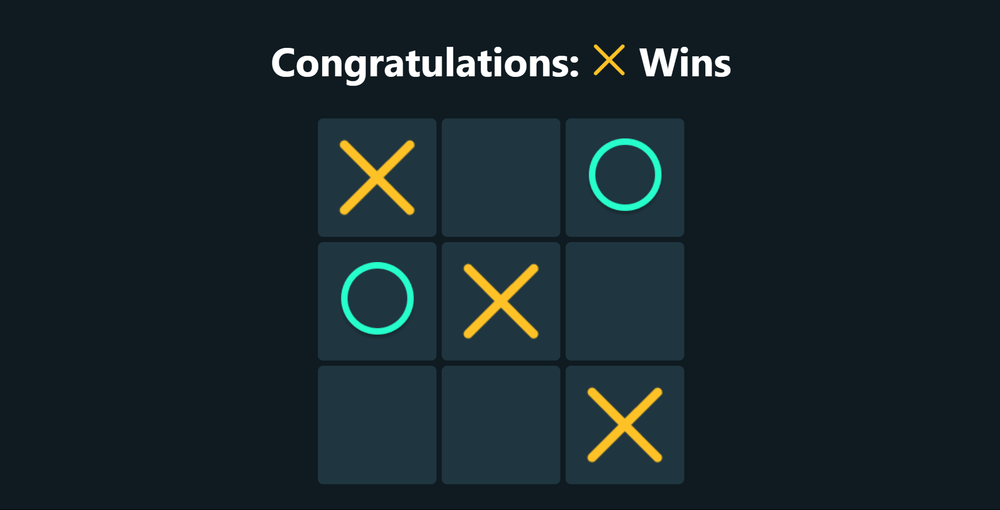

🎮 Tic Tac Toe Game - ReactJS
=============================

  
[**Click Here to Play the Game 🚀**](https://aditya-shukla-professional.github.io/Tic_Tac_Toe/)

* * *

📌 About
--------

This is a classic 2-player **Tic Tac Toe** game built using **React.js**. The goal is simple — get 3 marks in a row (horizontally, vertically, or diagonally) before your opponent does!

💡 Features
-----------

*   Two-player functionality (X vs O)
*   Automatic win/tie detection
*   Responsive UI with icons
*   Reset game functionality
*   Built with modern React practices

🖥️ Technologies Used
---------------------

*   ReactJS (Functional Components)
*   JavaScript (ES6+)
*   CSS for styling
*   HTML

🚀 Hosting
----------

*   Hosted on: **GitHub Pages**
*   URL: [https://aditya-shukla-professional.github.io/Tic\_Tac\_Toe/](https://aditya-shukla-professional.github.io/Tic_Tac_Toe/)

📷 Preview
----------

📁 Project Setup (for developers)
---------------------------------

\`\`\`bash git clone https://github.com/Aditya-Shukla-Professional/Tic\_Tac\_Toe.git cd Tic\_Tac\_Toe npm install npm start
